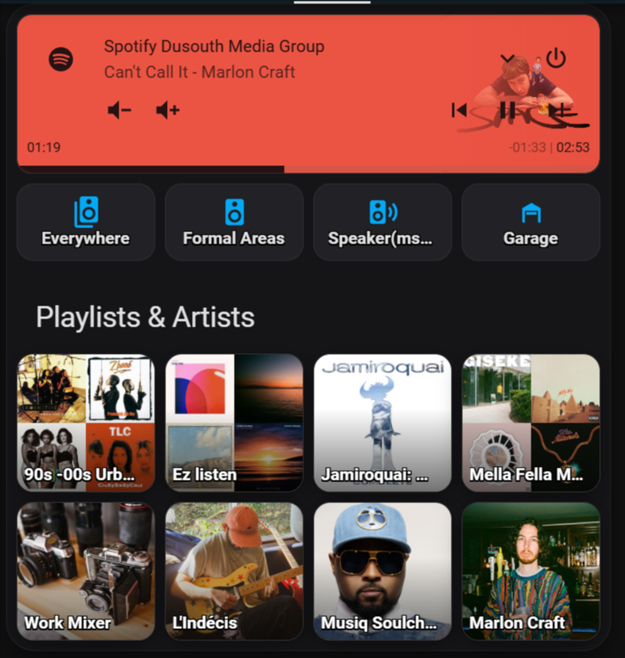
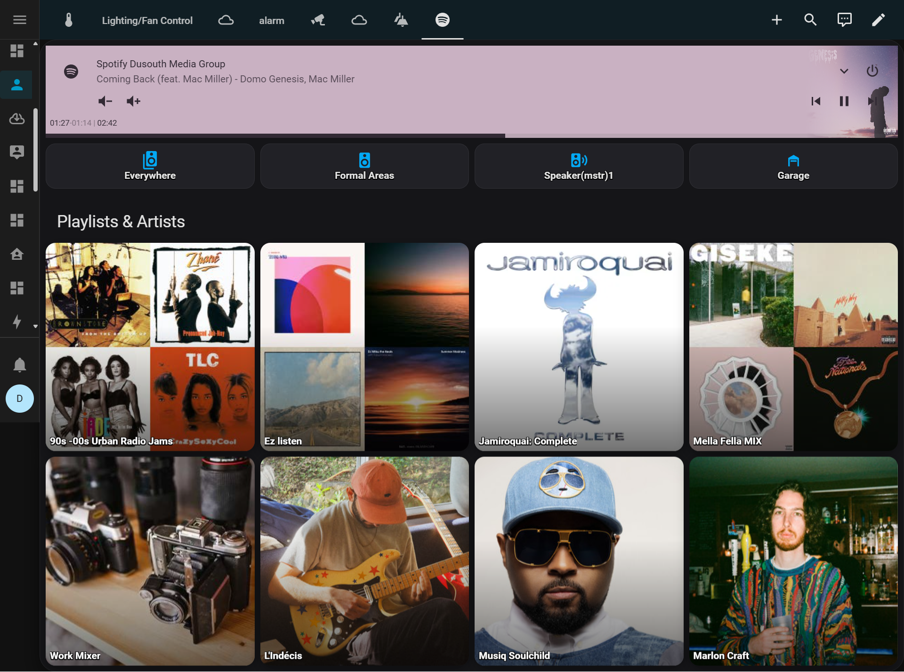

# Spotify Grid Card (Dark VisionOS)

[](https://github.com/biggiebytes/spotify-grid-card/releases)
[](LICENSE)
[](https://hacs.xyz/)
[](https://github.com/biggiebytes/spotify-grid-card/issues)
[](https://github.com/biggiebytes/spotify-grid-card)

A reusable Lovelace custom card that renders a Spotify media header + a 4-column (configurable) image grid of playlists. Tapping any tile calls `media_player.play_media` with your chosen entity. Adds volume and visual time remaining.





## Install (manual)
1. Download `dist/spotify-grid-card.js` and place it in `/config/www/community/spotify-grid-card/`.
2. Add to **Settings -> Dashboards -> Resources**:
   - URL: `/local/community/spotify-grid-card/spotify-grid-card.js`
   - Type: `JavaScript Module`
3. Use the card in your dashboard YAML.

## Install (CDN)
If you prefer to use jsDelivr CDN:
```yaml
resources:
  - url: https://cdn.jsdelivr.net/gh/biggiebytes/spotify-grid-card@latest/dist/spotify-grid-card.js
    type: module
```

## Install (HACS)
- Add this repo in **HACS -> Integrations -> Custom repositories** as type **Lovelace**.
- Open HACS, search **Spotify Grid Card**, and install.

## Card Config
```yaml
type: custom:spotify-grid-card
entity: media_player.spotify
title: Spotify
columns: 4
aspect_ratio: "1 / 1"
items:
  - name: Today's Top Hits
    image: https://i.scdn.co/image/ab67706f00000002b11...
    uri: spotify:playlist:37i9dQZF1DXcBWIGoYBM5M
  - name: Lo-Fi Beats
    image: https://i.scdn.co/image/ab67706f0000000384b...
    uri: spotify:playlist:37i9dQZF1DX8Uebhn9wzrS
  - name: Chill Hits
    image: https://i.scdn.co/image/ab67706f0000000320b8f86f7e59a67a7d9b5b57
    uri: spotify:playlist:37i9dQZF1DX4WYpdgoIcn6
  - name: Jazz Vibes
    image: https://i.scdn.co/image/ab67706f00000003...
    uri: spotify:playlist:37i9dQZF1DX0SM0LYsmbMT
```

## Development
```bash
pnpm i   # or npm i / yarn
pnpm build
# Output in dist/spotify-grid-card.js
```

## Versioning
- Follow Semantic Versioning. Tag releases, e.g. `v0.1.0`.
- Use GitHub Releases so HACS and jsDelivr can serve specific versions.

## Changelog
See [`CHANGELOG.md`](CHANGELOG.md) for release notes.

## Credits
Design & implementation by **biggiebytes**.
