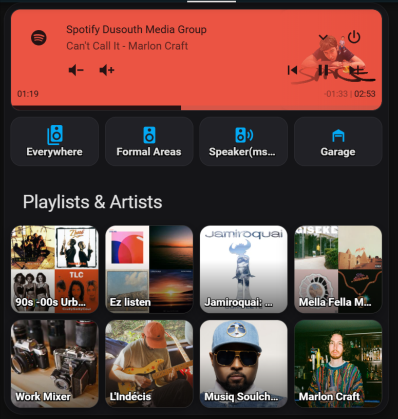
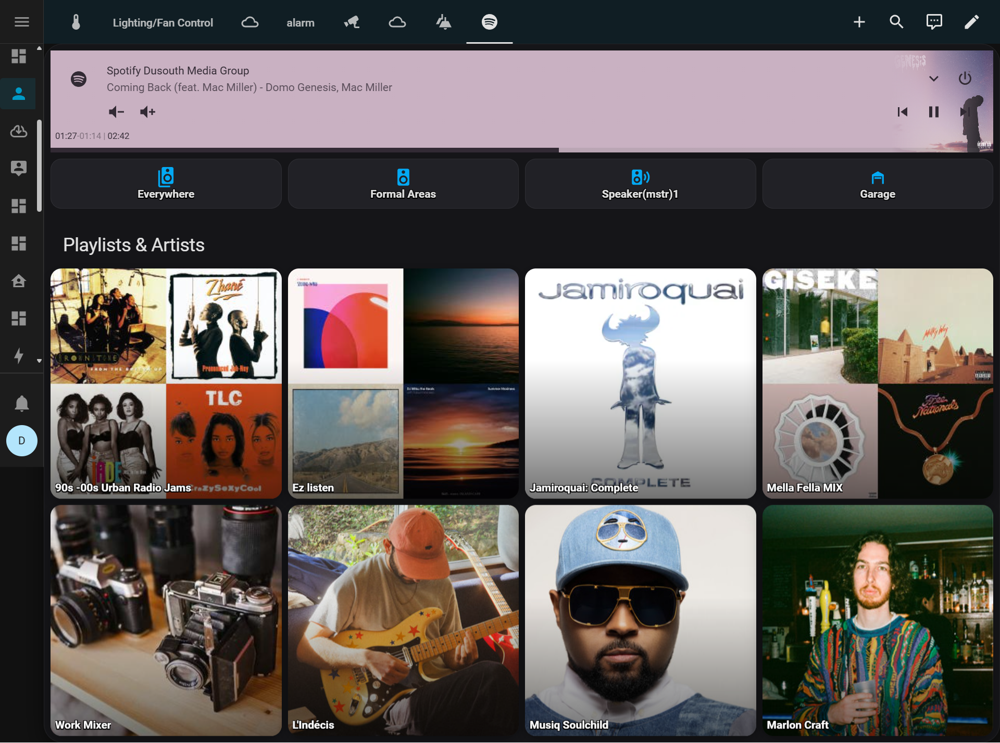

# Spotify Grid Card

[](https://github.com/biggiebytes/spotify-grid-card/releases)
[](LICENSE)
[](https://hacs.xyz/)
[](https://github.com/biggiebytes/spotify-grid-card/issues)
[](https://github.com/biggiebytes/spotify-grid-card)

A modern Home Assistant Lovelace card that provides a beautiful, touch-friendly Spotify browser for tablets, wall dashboards, and media centers.

Instead of navigating Spotify's interface, Spotify Grid Card lets you create a curated grid of your favorite playlists, albums, artists, or tracks. With a single tap, playback is sent to your selected Spotify media player using Home Assistant's standard `media_player.play_media` service.

Designed with simplicity, speed, and large touch targets in mind, it's ideal for dedicated Home Assistant dashboards.

---

## Features

- 🎵 Beautiful image-based Spotify grid
- 📱 Optimized for tablets and wall-mounted dashboards
- ⚡ Fast, lightweight, and HACS compatible
- 🎚 Built-in volume controls
- ⏱ Playback progress and remaining time
- 🎨 Clean VisionOS-inspired interface
- 🎧 Works with Spotify-compatible Home Assistant media players
- ⭐ Recommended for use with SpotifyPlus

---

## Screenshots

### Main Dashboard



### Alternative View



---

# Installation

## Option 1 – Install with HACS (Recommended)

1. Open **HACS**.
2. Select **Custom Repositories**.
3. Add:

```
https://github.com/biggiebytes/spotify-grid-card
```

4. Category: **Dashboard** (or **Lovelace** on older HACS versions).
5. Install **Spotify Grid Card**.
6. Restart Home Assistant if prompted.
7. Perform a hard refresh (Ctrl+F5) or clear your tablet/app cache if updating from a previous version.

HACS should automatically add the resource:

```
/hacsfiles/spotify-grid-card/spotify-grid-card.js
```

---

## Option 2 – Manual Installation

Copy:

```
dist/spotify-grid-card.js
```

to:

```
/config/www/community/spotify-grid-card/
```

Then add the resource:

```yaml
resources:
  - url: /local/community/spotify-grid-card/spotify-grid-card.js
    type: module
```

---

## Option 3 – jsDelivr CDN

```yaml
resources:
  - url: https://cdn.jsdelivr.net/gh/biggiebytes/spotify-grid-card@v0.1.1/dist/spotify-grid-card.js
    type: module
```

---

# Card Configuration

```yaml
type: custom:spotify-grid-card
entity: media_player.spotifyplus_your_account

title: Spotify

columns: 4
aspect_ratio: "1 / 1"

items:
  - name: Today's Top Hits
    image: https://i.scdn.co/image/...
    uri: spotify:playlist:37i9dQZF1DXcBWIGoYBM5M

  - name: Lo-Fi Beats
    image: https://i.scdn.co/image/...
    uri: spotify:playlist:37i9dQZF1DX8Uebhn9wzrS

  - name: Chill Hits
    image: https://i.scdn.co/image/...
    uri: spotify:playlist:37i9dQZF1DX4WYpdgoIcn6

  - name: Jazz Vibes
    image: https://i.scdn.co/image/...
    uri: spotify:playlist:37i9dQZF1DX0SM0LYsmbMT
```

> **Tip:** SpotifyPlus is recommended for the best experience, including improved playback control and device selection. The card also works with compatible Spotify media player entities exposed by Home Assistant.

---

# Troubleshooting

### The card doesn't appear

- Perform a hard browser refresh (**Ctrl+F5**).
- Clear the Home Assistant Companion App cache if using a tablet.
- Verify the resource URL is loaded.
- Restart Home Assistant after installing through HACS if necessary.

---

# Development

```bash
pnpm install
pnpm build
```

Build output:

```
dist/spotify-grid-card.js
```

---

# Versioning

Spotify Grid Card follows **Semantic Versioning**.

Create releases using GitHub Releases, for example:

```
v0.1.1
```

---

# Contributing

Bug reports, feature requests, and pull requests are welcome.

If you find Spotify Grid Card useful, please consider starring the repository—it helps others discover the project.

---

# Credits

Created and maintained by **biggiebytes**.

Special thanks to the Home Assistant community for testing, feedback, and inspiration.
